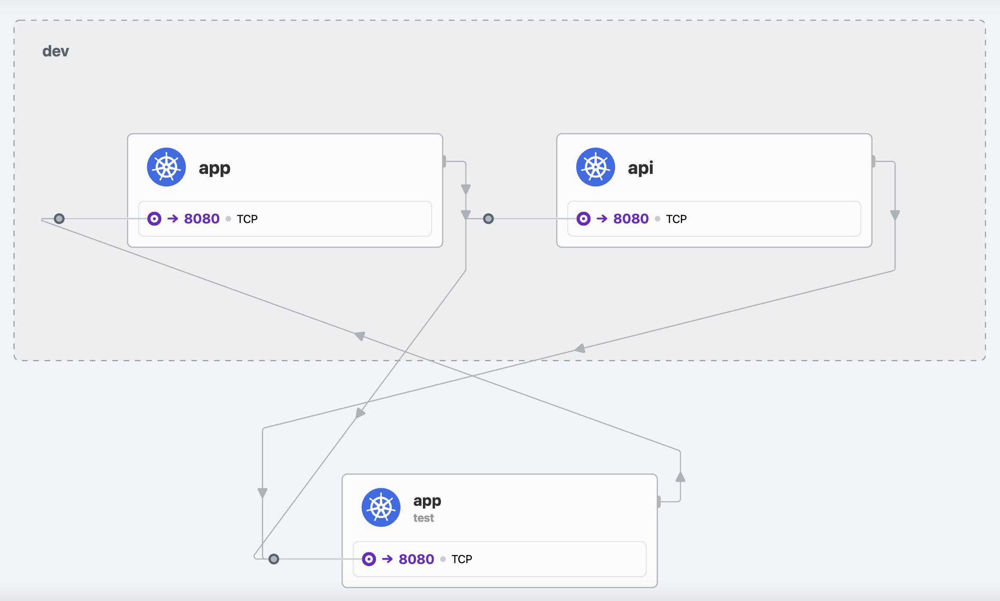

# Mimic
Creating a "live" infastructure from YAML config

## Install Generator
You can download `mimic-gen` from [Github Releases](https://github.com/Ivanhahanov/mimic/releases)
Download for MacOS on ARM
```bash
wget -c https://github.com/Ivanhahanov/mimic/releases/download/0.1.0/mimic_Darwin_arm64.tar.gz -O - | tar -xz
sudo mv ./mimic-gen /usr/local/bin/mimic-gen
```
## Quick start
Generate k8s manifests
```bash
mimic-gen examples/infra.yml 
```
Apply manifests
```bash
kubectl apply -f manifests/dev -f manifests/test/
```
As a result we get 3 services that send http requests to each other every 10 seconds

> [!TIP]
> You can explore how the services communicate using the [hubble ui](https://docs.cilium.io/en/stable/observability/hubble/hubble-ui/) or [hubble observe](https://docs.cilium.io/en/stable/observability/hubble/hubble-cli/)


## Config Example
Create two namespace `dev` and `test` with services `dev/app`, `dev/api` and `test/app`.

* `dev/app` - port `8080`, url `/dev`, requests to `app.test` and `api` services
* `dev/api` - port `8080`, url `/api`, requests to `app.test` service
* `test/app` - port `8080`, url `/test`, requests to `app.dev` service
```yaml
image: explabs/mimic
namespaces:
  - name: dev
    resources:
      - deployment:
          name: app
          ingress:
          - http:
              port: 8080
              endpoints:
                - url: /dev
                  resp: "Hello from dev"
          egress:
          - http:
              interval: 10
              requests:
                - uri: http://app.test:8080/test
                  method: POST
                - uri: http://api:8080/api
                  method: POST
      - deployment:
          name: api
          ingress:
          - http:
              port: 8080
              endpoints:
                - url: /api
                  resp: "api"
          egress:
          - http:
              interval: 10
              requests:
                - uri: http://app.test:8080/test
                  method: POST

  - name: test
    resources:
      - deployment:
          name: app
          ingress:
          - http:
              port: 8080
              endpoints:
                - url: /test
                  resp: "Hello from test"
          egress:
          - http:
              interval: 10
              requests:
                - uri: http://app.dev:8080/dev
                  method: GET
```
